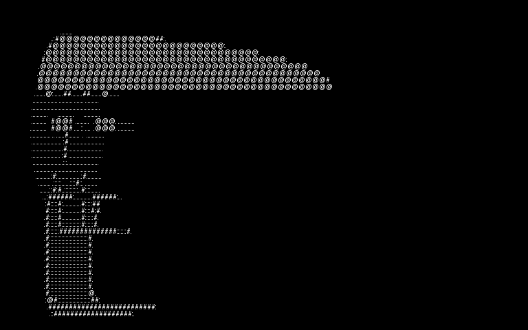

# AlphaArt


Convert portraits, animals, and simple scenes into sharp alphabet and character art with a responsive web app powered by Next.js and FastAPI.

AlphaArt accepts an uploaded image, rebuilds it using text characters, and lets you preview or export the result as plain text, SVG, or PNG.

## Suggested GitHub repository description

Convert portraits, animals, and simple scenes into sharp ASCII and character art with a Next.js + FastAPI web app.

## Highlights

- Responsive upload-to-preview workflow
- Sharpened character mapping for portraits and simple nature scenes
- Minimal, dense, and alphanumeric character presets
- Export support for text, SVG, and PNG

## What it does

- Upload a portrait, pet photo, tree, or simple landscape
- Convert the image into character art using curated symbol ramps
- Adjust output width, brightness, contrast, inversion, dithering, and color mode
- Preview the generated result in the browser
- Download the final output as plain text, SVG, or PNG

## Example gallery

These example assets were generated with the current AlphaArt pipeline using `Minimal ASCII` mode.

### Portrait example

Input:


Output:



### Animal example

Input:


Output:


### Nature example

Input:


Output:


The corresponding plain text outputs are also committed in `docs/examples`.

## Project structure

- `frontend` - Next.js app for upload, controls, preview, and download actions
- `backend` - FastAPI API for image conversion and export rendering
- `plan.md` - product and technical spec for the current implementation direction

## Requirements

- Node.js 20+
- Python 3.11+
- npm

## Run locally

### 1. Start the backend

From `backend`:

```powershell
py -3.11 -m venv .venv
.\.venv\Scripts\Activate.ps1
pip install -e .[dev]
uvicorn app.main:app --reload
```

The API will run at `http://127.0.0.1:8000`.

### 2. Start the frontend

Open a second terminal and run from `frontend`:

```powershell
npm install
$env:NEXT_PUBLIC_API_BASE_URL="http://127.0.0.1:8000"
npm run dev
```

The web app will run at `http://127.0.0.1:3000`.

## How to use the app

1. Open the frontend in your browser.
2. Click `Source image` and upload a portrait, pet photo, tree, or other simple image.
3. Choose an output width. Higher widths preserve more detail but create denser text art.
4. Pick a character preset:
	 - `Dense ASCII` for more detailed portraits and textured nature scenes
	 - `Minimal ASCII` for bold, graphic output
	 - `Alphanumeric` for a more stylized letter-based look
5. Adjust `Brightness` and `Contrast` if the face, fur, branches, or edges look too flat.
6. Toggle `Invert` if the image reads better with a reversed tonal mapping.
7. Toggle `Dithering` if you want a rougher, posterized texture.
8. Click `Generate artwork`.
9. Download the result as `text`, `SVG`, or `PNG`.

## Tips for better results

- Use portraits with clear lighting and a distinct subject against the background.
- Use simple nature images with strong silhouettes, such as trees, birds, cats, dogs, or leaves.
- Increase output width for faces and animal fur when you want more fine detail.
- Use grayscale for stronger tonal readability and color mode for stylized poster-like results.
- Avoid very busy backgrounds if the main subject should stay readable.

## Current implementation status

- FastAPI backend with a `POST /api/v1/convert` endpoint
- Edge-aware preprocessing for sharper character mapping
- Next.js frontend with responsive upload, preview, and download flow
- Export support for plain text, SVG, and PNG
- Backend smoke tests for healthcheck and conversion flow

## Next improvements

- Add portrait and nature-specific presets
- Improve font metrics and renderer fidelity for exported PNGs
- Add end-to-end frontend tests
- Add example images and result gallery for the GitHub page